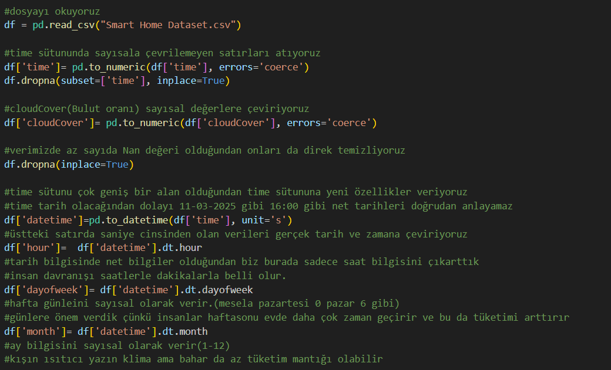
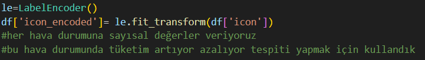
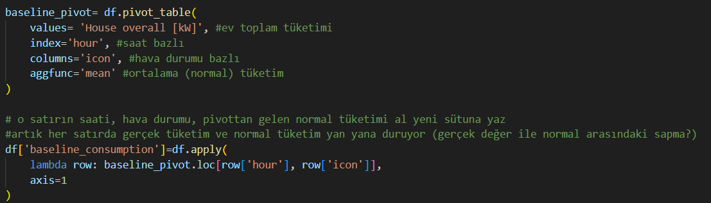
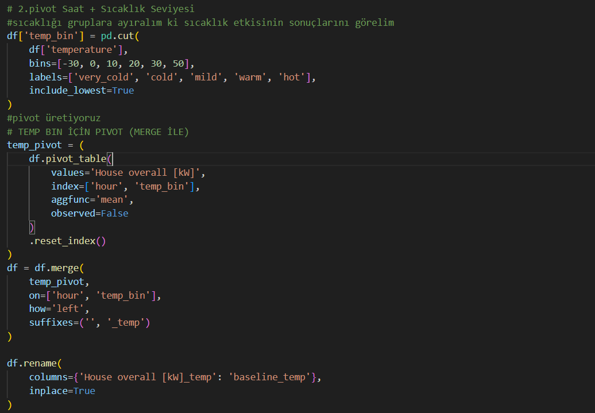
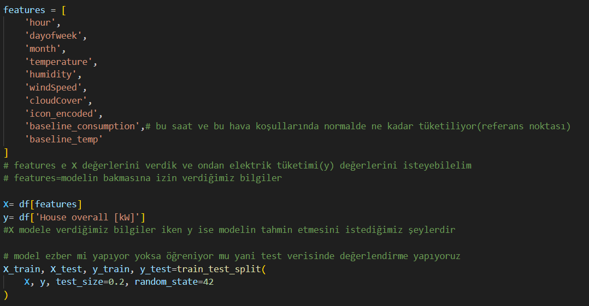
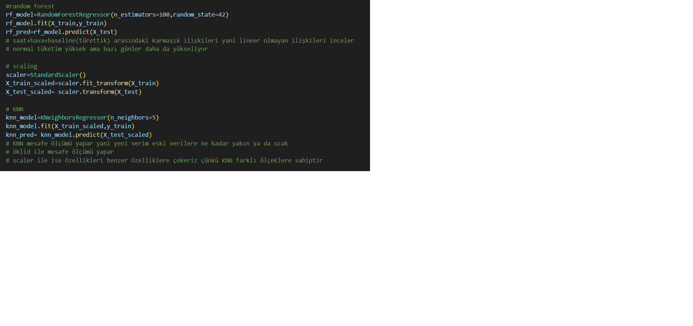

# akilli-ev-enerji-tahmini
Bu projenin amacı, bir akıllı eve ait zaman ve hava durumu verilerini kullanarak evin anlık toplam elektrik tüketimini (kW) tahmin etmektir. Projede, tüketimi sınıflandırmak yerine gerçek tüketim değerini tahmin eden regresyon tabanlı bir yaklaşım benimsenmiştir.

# Verinin içeriği

# Amaç Ve Tahmin edilen değişken
- Modelin tahmin etmeye çalıştığı hedef değişken House overall [kW] değişkenidir. Bu değişken evin belirli bir andaki toplam elektrik tüketimini (kW cinsinden) temsil etmektedir. Bu problem bir regresyon problemi olarak ele alınmış ve modelden sürekli (sayısal) bir çıktı üretilmesi hedeflenmiştir.
- Regresyon alma sebebimiz ise biz tüketimin yüksek mi düşük mü gibi basitleştirilmiş bir sınıflandırma yapmak yerine gerçek tüketimi tahmin etmek istedik. 

# Kullanılan değişkenler
Modelde 3 ana değişken gubu kullandık:

## 1-Zaman tabanlı değişkenler
Zaman bilgisi, ev içi enerji tüketiminin günlük ve haftalık alışkanlıklara bağlı olarak değişmesi nedeniyle modelimizde çok önemlidir. Bu nedenle zaman değişkeni (time) kullanılarak aşağıdaki türetilmiş değişkenler elde edilmiştir:
•	hour: saat
•	dayofweek: gün
•	month: Ay 
Bu değişkenler, ev halkının günlük rutinlerini ve mevsimsel davranışlarını modele yansıtmak amacıyla kullanılmıştır.
Başta direk time olarak kullandığımız zaman bu değişken bize direk anlık olarak net bir tarih ve saat değeri döndürdüğünden dolayı analiz sürecinde sıkıntı çıkartacaktı.

## 2-Hava durumu değişkenleri
Ev enerji tüketimi, özellikle ısıtma ve soğutma sistemleri nedeniyle hava koşullarından etkilenmektedir. Bu nedenle aşağıdaki hava durumu değişkenleri modele dahil edilmiştir:
•	temperature (sıcaklık)
•	humidity (nem oranı)
•	windSpeed (rüzgar hızı)
•	cloudCover (bulut oranı)
•	icon (kategorik hava durumu etiketi, sayısal olarak encode edilmiştir) 
Bu değişkenler, evin enerji ihtiyacını dolaylı olarak etkileyen çevresel faktörleri temsil etmektedir.

## 3-Pivot (Baseline) Değişkenleri
Amaç, evin farklı koşullar altında sahip olduğu normal enerji tüketimini sayısal bir referans noktası olarak modele öğretmektir.
Bu kapsamda iki farklı pivot tablo oluşturulmuştur:
•	Saat + Hava Durumu (icon) bazlı pivot
→ baseline_consumption
•	Saat + Sıcaklık Seviyesi (temperature bin) bazlı pivot
→ baseline_temp
Bu pivot tablolar, belirli saatlerde ve belirli hava koşullarında evin ortalama tüketimini temsil etmektedir. Daha sonra bu ortalama değerler ana veri setine eklenerek, modelin normal tüketimden sapmaları öğrenmesi sağlanmıştır.

# Kullanılmayan Değişkenler
Veri setinde yer alan bazı değişkenler bilinçli olarak modele dahil edilmemiştir. Bizim analizini yapmak istediğimiz konumuz hava durumu ve sıcaklık-soğukluk etkilerinin evdeki toplam enerji tüketimine etkileri olduğundan bazı verilerin sadece kalabalıklaştırdığını ve karmaşıklığı arttırdığını fark ettik.
- Dishwasher, Fridge, Microwave, Furnace, Kitchen, Living room gibi cihaz bazlı güç tüketimi değişkenleri, evin toplam tüketiminin genel bileşenleridir. Bu değişkenlerin modele dahil edilmesi, hedef değişkenin zaten parçalarını modele vermek anlamına geleceği için veri sızıntısı oluşturacaktır.
- Bizim ana hedefimiz zaten house overall[kW] bulmak olduğundan bunları ayrı ayrı almak mantıksızdı çünkü toplamı tahmin ederken parçaları kullanmadık işimiz toplamlaydı.
- apparentTemperature (hissedilen sıcaklık), dewPoint (çiğ noktası) , pressure (atmosfer basıncı), windBearing (rüzgar yönü), visibility (görüş mesafesi), precipIntensity (yağış şiddeti) , precipProbability  (yağış olasılığı) ve summary(hava durumu özeti) gibi değişkenler ya sıcaklık ve nem ile yüksek korelasyona sahip olmaları ya da ev içi enerji tüketimi üzerinde doğrudan etkiye sahip olmamaları nedeniyle modele dahil edilmemiştir. Bu değişkenlerin kullanılması, model karmaşıklığını artırırken tahmin başarısını artırmamaktadır.

# Pivot nedir ve neden kullandık ?
Pivot, çok sayıda veriyi daha anlaşılır hale getirmek için kullanılan bir özetleme yöntemidir. Ham veriler genellikle satır satır ve dağınık halde bulunur. Pivot işlemi, bu verileri belirli kurallara göre gruplayarak ortalama, toplam veya sayım gibi özet değerler üretir.
Kısaca pivot, çok fazla bilgiyi tek bir tablo halinde özetleme yöntemidir. Sadeleştirme diyebilirz.

Enerji tüketimi gibi insan davranışına bağlı verilerde, anlık değişimler sıkça görülür. Pivot tablolar, bu anlık değişimleri azaltarak verinin genel yapısını ortaya çıkarmaya yardımcı olur.
Yani pivot sayesinde tek tek ölçümlere bakmak yerine, verinin ortalama davranışı anlaşılır hale gelir.

# Veri seti ve ön hazırlık 
- Projede Smart Home Dataset.csv veri seti kullandık.
- time sutununda sayısala çevrilmeyen satırları atıyoruz
- cloudCover(bulut oranı) satırını sayısal verilere çevirdik
- time satırı net bi bilgi olduğundan dolayı bunu hour,dayofwwek ve month olarak parçalıyoruz.

## encoder aşaması
- Hava durumunu sayısallaştırıyoruz çünkü tüketim artıyor azalıyor tespiti yapmak için sayısal değerlere ihtiyacımız oldu.

## Pivot tablosu
- Pivot uygularken o satırın saati hava durumu ve normal tüketimini alıp yeni bir satıra yazıyoruz bu şekilde yan yana gözüken değerlerde sapma oranını bulmamız kolaylaşıyor.

- 2.pivot tablomuzda ise saat ve sıcaklık arasındaki ilişkiyi ele aldık. Öncelikle sıcaklık değerlerini verdikten sonra sıcaklık değerine göre değerlendirme içeren bir atama yaptık

## features ve test kısmı
- features kısmına işlediğimiz, oluşturduğumuz ve tablodaki bazı değerlerin bilgisini veriyoruz. Yani sadece bu kolonlara bakma izni veriyorum diyerek veri sızıntısını önlüyoruz.
- X değerine ise features girdisinin verilerini veriyoruz y ise tahmin etmesini istediklerimizdir.
- model ezber mi yapıyor yoksa öğreniyor mu yani test verisinde değerlendirme yapıyoruz kontrolü için ise resmimizin en altındaki kodları yazıyoruz

## Model eğitimi ve sonuçlar 
- house overall[kW] ,sürekli ve sayısal bir değer olduğu için problem bir regresyon problemi olarak ele aldık.
- Random Forest modeli, birden fazla karar ağacının çıktısını birleştirerek tahmin yapan güçlü bir regresyon yöntemidir. Bu model doğrusal olmayan ilişkileri yakaaybilen ve daha kararlı sonuçlar elde edebilmesinden dolayı seçilmiştir. Enerji tüketimi gibi birçok faktöre bağlı ve düzensiz yapıya sahip veriler için uygun bir modeldir.
- KNN modeli, bir veri noktasına en yakın komşuların ortalamasını alarak tahmin yapar. Ayrıca mesafe tabanlı bir yöntem olduğu için verilerin ölçeklendirilmesi gerektiğinden, veri ön işleme sürecinin etkisini gözlemlemek açısından da faydalı olmuştur.
- Scaling ,arklı büyüklüklerdeki sayısal değerler, ölçekleme yapılmadan kullanıldığında bazı modeller için yanıltıcı olabilir. birbirinde bağımsız değerler (örneğin saat=20, nem=0.45 gibi) birbirine üstünlük kurmasın diye kullanılmıştır.

- Sonuçlarımıza baktığımızda ise Random Forest modeli yaklaşık 0.54 R² değeri elde etmiş ve 0.29 kW MAE ile KNN modeline kıyasla daha başarılı sonuçlar üretmiştir.
- KNN modeli ise yaklaşık 0.46 R² ve 0.32 kW MAE değerleri ile daha sınırlı bir performans sergilemiştir.
- Ortalama hata, yaklaşık 300 Watt, bunu gerçek hayatta düşünürsek
bir ampul ≈ 60W
300W ≈ 5 ampul
Yani model çoğu zaman 4–5 ampul kadar yanılıyor bu ev enerjisi için çok kabullenilebilir bir hata
- diğr bir yönden ise direk cihaz bazlı veriler ile direk sayısal tamin yaptığımızdan (regresyon kullanma sebebimiz) sonuçlar bu şekildedir.

